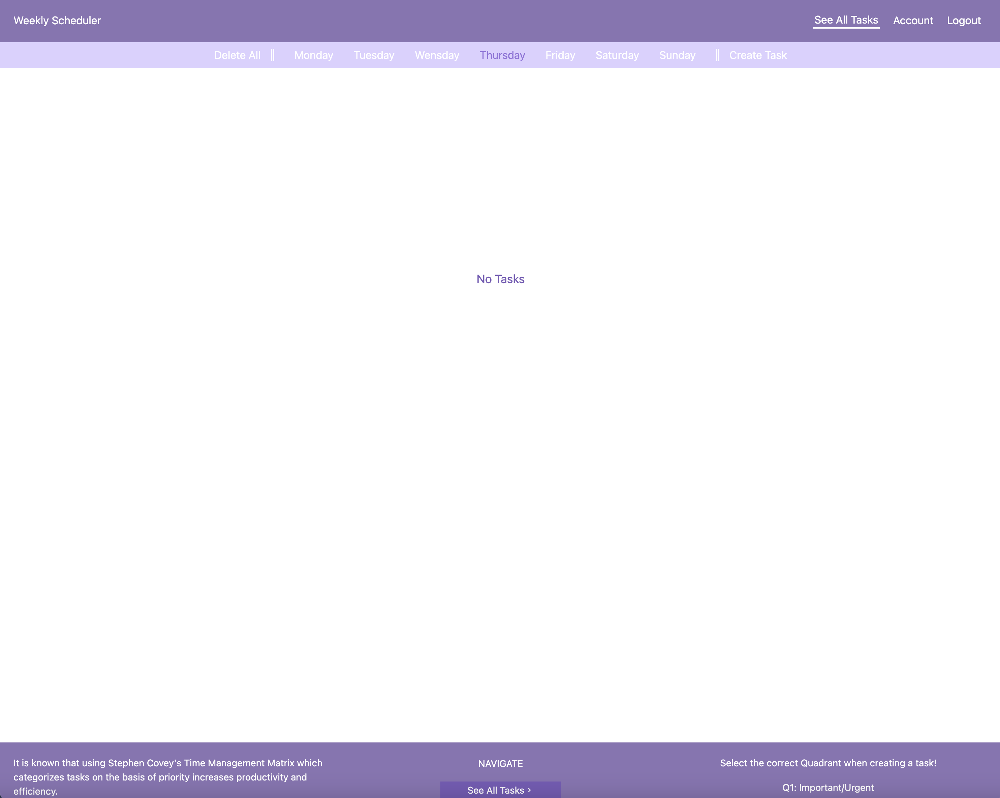
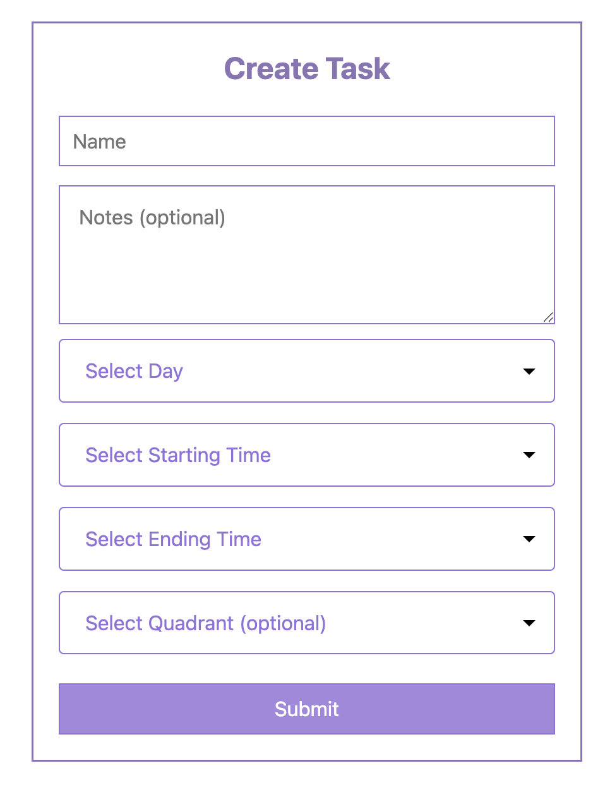

# Weekly Scheduler

## Description

This application is designed to help organize your weekly schedule and tasks efficiently. It allows you to create tasks for specific time intervals (hours or 30-minute blocks) and add notes for additional details. You can also break down larger tasks into smaller, manageable sub-tasks. Tasks are organized by day of the week and stored in a database, enabling access across multiple devices. The application features a completion check function to track progress. Additionally, it incorporates the Covey Time Management Matrix, categorizing tasks by importance and urgency to enhance productivity.

## Table of Contents

- [Features](#features)
- [Usage](#usage)
- [License](#license)
- [How to Contribute](#contribute)
- [Questions](#questions)

## Features:

- Tasks Displayed with checkboxes.
- Tasks can have Mini-tasks (smaller tasks needed to accomplish the bigger parent task).
- Covey Time Management Matrix for task identification.
- Easy to use interface

## Usage

After entering into the website, you can do the following.

1. Login or Signup

2. See all tasks by day of the week

3. Add a task and even mini-tasks to the users saved tasks.

4. See a specific task including all mini-tasks for that parent task.

5. See a selected mini-tasks

## Homepage

## Login

## Sign up

## All Tasks

## Create Form

## Mini-Tasks

## Website URL

`https://weekly-schedular.herokuapp.com/`

## License

The license used for this project: MIT

## Contribute

If you would like to contribute please contact me.

## Questions

To reach me please contact me in the email address below!

- GitHub: `https://github.com/KarenHarley`
- Email: `karenharley88@gmail.com`
