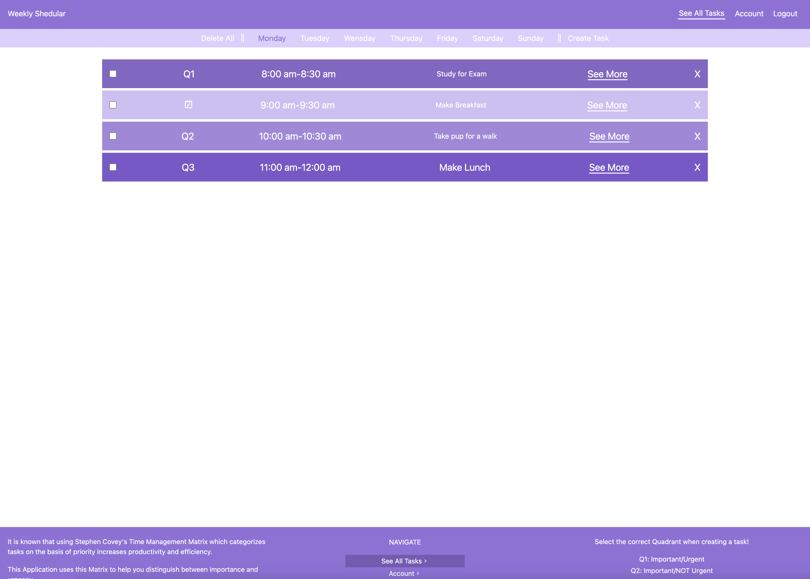

# Weekly Shedular

This application to helps organize your weekly schedule and tasks. It has the option to create a task for a certain amount of time (hour(s) or 30 min) with notes for additional information and the option to create smaller mini-tasks within a larger one. All of these tasks are seperated by day of the week and are stored in a database to ensure the user can access them in any device. It also has a checked property that allows use to know which is completed. This application uses the four quadrants of the Covey Time Management Matrix to help with identifying a tasks importance. 

### Features:
- Tasks Displayed with checkboxes.
- Tasks can have Mini-tasks (smaller tasks needed to accomplish the bigger parent task).
- Covey Time Management Matrix for task identification.
- Easy to user interface

### Homepage

### Login

### All Tasks Page

